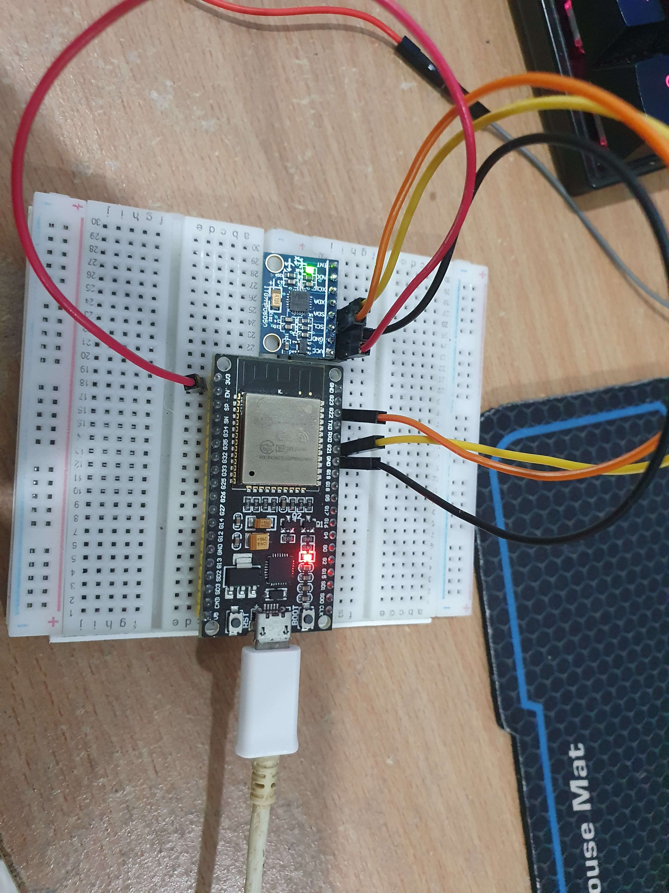

# ESP32VR
A VR headset using the ESP32 Microcontroller

Current hardware:
- ESP32-Wroom
- MPU6050 Accel/Gyro
- Generic Phone Headset
- 2 STM32 Bluepills (possible controller microcontroller?)
- Additional 2 MPU 6050 for controllers
- 360 and Xone kinect for full body tracking
- Tang Nano 9K FPGA (Potential future use for onboard rendering, etc)
Future Hardware List:
- MIPI-HDMI 2K 120hz displays (Aliexpress - ~$110 AUD)

ESP32 Config:
MPU6050 to ESP32 data sent through I2C
- Pin 22: SCL
- Pin 21: SDA

Currently Implemented:
- Roll/Pitch calculation

TODO:
- Add yaw calculation
- Send raw and yaw/pitch/roll data via http to computer
- Link with OpenVR/SteamVR (Potential Monado Support)
- 3D print case for back of head (Houses controller electronics, back of head for weight distribution)
